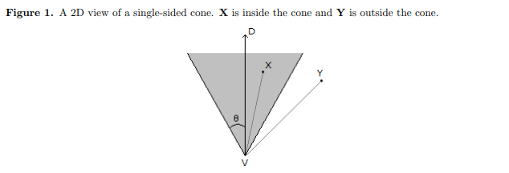
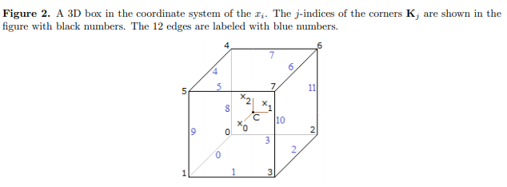
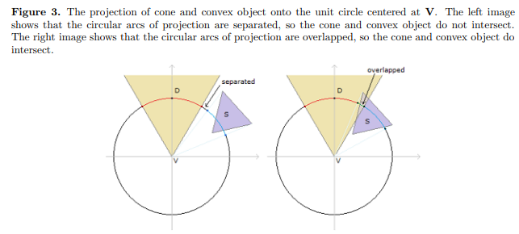
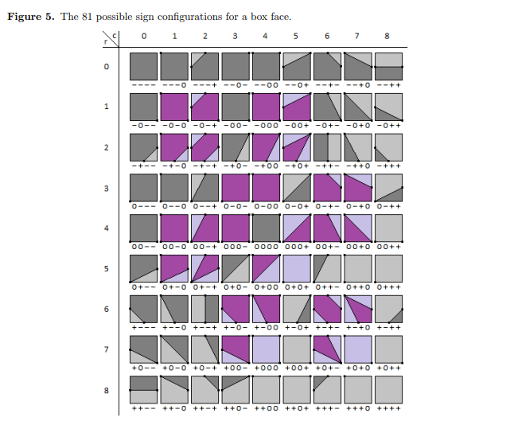

[IntersectionBoxCone]
==
[Geometric Tools][geometrictools]  

_以下内容视为一个流程_  

### Cone  

<details>
<summary>Cone</summary>

>An infinite, single-sided, solid cone has a vertex __V__,  
an axis ray whose origin is __V__ and unit-length direction is __D__  
and an acute cone angle θ ∈ (0, π/2)  

Cone 有一个顶点 __V__, 单位方向 __D__, 半角 __θ__  

>A point __X__ is inside the cone when __X__ = __V__  
or when the angle between __D__ and __X__ - __V__ is in [0, θ]  
Algebraically, the containment is defined by  
__F__(__X__) = __D__ · ( __X__ - __V__ ) / | __X__ - __V__ | - cos(θ) ≥ 0  
 
等于时表示在圆锥面上  
在关心的[0, π/2]范围内, 越在 cone 里面 cos 值越大  
( __X__ - __V__ ) / | __X__ - __V__ | 表示把点投影到单位球面上  
_投影指这种计算方式, 不是透视投影这种_  

  

> The single-sided cone is _finite_ when you specify a maximum height h<sub>max</sub> > 0 measured along the cone axis,  
in which case __D__ · ( __X__ - __V__ ) ≤ h<sub>max</sub>.  

> A _cone frustum_ occurs when you specify a minimum height h<sub>min</sub> and a maximum height h<sub>max</sub>  
with 0 ≤ h<sub>min</sub> ≤ h<sub>max</sub>  

</details>


### Definitions of Oriented Box  

<details>
<summary>Definitions of Oriented Box</summary>

> An oriented box has a center __C__,  
uint-length axis directions __U__<sub>i</sub> that form a right-handed orthonormal set  
and extents e<sub>i</sub> > 0 that measure half the edge length in each dimension  
0 ≤ i ≤ 2  

oriented box 有一个中心 __C__, 三个正交轴U<sub>i</sub>, 和在三个轴上的扩展距离  
_对应 Unity 的 center, rotation, halfExtents_  

> A point P in the box may be written as  
__P__ = __C__ + Σ x<sub>i</sub> __U__<sub>i</sub>  
where x<sub>i</sub> = __U__<sub>i</sub> · ( __P__ - __C__ ) and |x<sub>i</sub>| ≤ e<sub>i</sub>  
0 ≤ i ≤ 2

   
</details>


### Test-Intersection Query by Projection  

<details>
<summary>Test-Intersection Query by Projection</summary>

> A set S is said to be _convex_ if for any pair of points in S,  
the segment connecting them is in S.  
that is, if __X<sub>0</sub>__ ∈ __S__ and __X<sub>1</sub>__ ∈ __S__
then t __X<sub>0</sub>__ + (1 - t) __X<sub>1</sub>__ ∈ __S__ for all t ∈ [0, 1]  

convex 里的任何两个点的连线上的所有点也在 convex 内  

> We want to formulate test-intersection queries  
that determine whether a single-sided cone and a convex object overlap.  
>
> If S is a convex set of points that represent the object,  
project those points onto the unit sphere whose center is V.  
the solid cone itself projects onto a spherical disk whose spherical radius is θ.  
>
>The cone and convex object intersect when two projections overlap.  
 
_?? 按前面的计算方式来看, 投影只是在球面上. 中心相同的情况下, 球面投影相交, 他们也一定相交吗_  

> To determine there is overlap, we need only find one point in the overlap set.  
Equivalently as spherical distance problem,  
we need only find one point in the projection of the convex object  
that is within a distance θ of the spherical point corresponding to the cone axis direction.  

为了确定是否相交, 只需要在 convex object 的投影中找到一个点, 它离 cone 的轴的投影点在 距离 θ 之内.  
_在单位球中, 球面距离和角度是一回事_  

> This is a fancy way of stating   
that we need to find __X__ ∈ S whose projection ( __X__ - __V__ ) / | __X__ - __V__ |  
forms an angle with __D__ by an angle no larger than θ.  
>
> however, the formulation as a projection allows us to  
derive an algorithm to locate the point __A__ whose projection is closest to __D__.   
This amounts to computing __A__ that maximizes the dot product of the projection with __D__.

这个问题等同于, 计算出点 S 中的 __A__, 它的投影中与 D 的 product 最大  

  

> An important observation for an infinite cone is the following.  
If the cone axis intersects the convex object,  
then the object and cone intersect.  

无限 cone 的 axis 和 convex 相交那么他们相交  

> If the cone axis does not intersect the convex object,  
the point __P__ of the object that minimizes the angle between __P__ - __V__ and the cone axis is on the boundary of the object.  

如果 cone axis 和 convex 不相交, 那么 S 中 `使 P - V 与 axis 角最小的点 P` 一定在 convex 的边界上  

> if the object is a convex polyhedron,  
 __P__ is either a vertex or an edge-interior point or a face-interior point.  

_强调 convex_  

> If it is a face-interior point,  
then there are infinitely many pints that attain the minimum angle.  
the cone axis must be parallel to the face.

> we can restrict our search for a point attaining minimum angle to  
edges of the convex polyhedron.  
This avoids having to compute explicitly the spherical polygon of projection,  
instead searching relevant edges of the convex polyhedron.  

_?? 不明白这个简化是什么意思_  

.png)  

</details>


### Intersection with an Oriented Box  

<details>
<summary>Intersection with an Oriented Box</summary>

> The oriented box is a convex polyhedron.  
When testing for intersection with an infinite cone,  
we can process the box as a whole.

> However, when the cone is truncated by one or both of the __D__ · ( __X__ - __V__ ) = h<sub>min</sub> and __D__ · ( __X__ - __V__ ) = h<min>max</min>,  
the box must be clipped against the relevant planes before  
searching for a point that minimizes the angle with the cone axis.
 
如果 cone 是 finite cone 或者 cone frustum, box 必须先被相应的平面 clip 才行  

> The clipped box is a convex polyhedron  
and can be viewed as the intersection of the box with an _infinite slab_ bounded by the two planes.  

裁剪之后的 convex polyhedron 可以看作是 box 和 infinite slab 的相交部分  
_infinite slab 指平面 h<sub>min</sub> 和 h<sub>max</sub> 之间的区域_  


#### Quick Rejectance Test: Box Outside the Slab

<details>
<summary>Quick Rejectance Test: Box Outside the Slab</summary>

总体思路是比较盒子在 axis 上的投影, 如果这个投影在 cone 的 h 范围之内才有相交的可能  

> The infinite cone projects onto the axis in a set of points __Q__ = __V__ + h __D__,   
where h ∈ [h<sub>min</sub>, h<sub>max</sub>] ⊂ [0, +∞).  
The projection of point __P__ is __D__ · ( __P__ - __V__ ).  

_这里应该是 finite cone_  

> The box projection onto the cone axis also results in an interval of h-values, say [b<sub>min</sub>, b<sub>max</sub>] ⊂ R.  
If the two projection intervals do not overlap in an interval of positive length,  
then the box and cone do not intersect in a region of positive volume.  

把 box 也投影到 axis 上, 如果不重合他们一定不相交  

> The projection of a box point __P__ onto the cone axis has projection scalar:    
h = __D__ · ( __C__ - __V__ ) + Σx<sub>i</sub> __D__ · __U__<sub>i</sub>  
0 ≤ i ≤ 2  

_这是先投影点再计算h_  
_效果跟先计算点后投影 h = __D__ · ( __C__ + Σx<sub>i</sub> __U__<sub>i</sub> - __V__) 相同_  

> The extreme values occur when x<sub>i</sub> = σ<sub>i</sub>e<sub>i</sub> where |σ<sub>i</sub>| = 1.  
The maximum value of h occurs by choosing σ<sub>i</sub> = Sign( __D__ · __U__<sub>i</sub> ).  
The minimum value of h occurs by choosing σ<sub>i</sub> = -Sign( __D__ · __U__<sub>i</sub> ).  

_不管 __D__ 是什么, 极限值一定在盒子的顶点之中_  
_和__D__方向相同得到h<sub>max</sub>, 相反得到h<sub>min</sub>_

> b<sub>min</sub> = __D__ · ( __C__ - __V__ ) - Σe<sub>i</sub>| __D__ · __U__<sub>i</sub> |  
b<sub>max</sub> = __D__ · ( __C__ - __V__ ) + Σe<sub>i</sub>| __D__ · __U__<sub>i</sub> |  
>
> The box and cone do not intersect in a region of positive volume when b<sub>min</sub> > h<sub>max</sub> or b<sub>max</sub> < h<sub>min</sub>  

```c#

  public static void ComputeBoxHeightInterval(MathBox box, MathCone cone, out float boxMinHeight, out float  boxMaxHeight)
  {
      var DdCmV = Vector3.Dot(cone.direction, box.center - cone.position);
      
      var radius = box.e0 * Mathf.Abs(Vector3.Dot(cone.direction, box.U0)) +
                   box.e1 * Mathf.Abs(Vector3.Dot(cone.direction, box.U1)) +
                   box.e2 * Mathf.Abs(Vector3.Dot(cone.direction, box.U2));
      
      boxMinHeight = DdCmV - radius;
      boxMaxHeight = DdCmV + radius;
  }

```
_?? 为什么不也对另外两个轴投影_  

</details>


#### Quick Acceptance Test: Cone Axis Intersects the Box  

<details>
<summary>Quick Acceptance Test: Cone Axis Intersects the Box</summary>

> we can test whether the relevant linear component of the cone intersects the box.  
if it does, the test-intersection query is complete.  
the linear component of the cone axis for an infinite cone or infinite frustum is the ray  
__V__ + h __D__ for h ∈ [h<sub>min</sub>, +∞).  
for a finite cone frustum,  the linear component is the segment  
__V__ + h __D__ for h ∈ [h<sub>min</sub>, h<sub>max</sub>].  
Therefore, we need to execute a test-intersection query for [ray-box or segment-box][IntersectionLineBox].

_如果有必要, Unity 中会有对应的射线检测, 暂时跳过_  

</details>


#### Box Fully Inside the Slab  

<details>
<summary>Box Fully Inside the Slab</summary>

> we next test whether the box is fully contained in the slab defined by the planes  
__D__ · ( __X__ - __V__ ) = h<sub>min</sub> and __D__ · ( __X__ - __V__ ) = h<sub>max</sub>.  
In this case the box does not have to be clipped against the planes and its edges can be processed fully.  
The box is inside the slab when h<sub>min</sub> ≤ b<sub>min</sub> and b<sub>max</sub> ≤ h<sub>max</sub>  

</details>


#### Box Straddles at Least One Slab Plane  

<details>
<summary>Box Straddles at Least One Slab Plane</summary>

> At this point this box is intersected by one of the slab,  
and the intersection must be a convex polyhedron with positive volume.  
We know the relevant linear component of the cone axis does not intersect the polyhedron,  
so a polyhedron point that achieves the maximum dot product must occur on a polyhedron face.  
As noted previously, such a point can be found on a polyhedron edge.  

h-distance 最大的点一定在这个被裁剪的多面体的面(边)上  

_? 特别说明 relevant linear component 是为了强调 h<sub>min</sub> h<sub>max</sub> 吗_  
_?? 为什么强调轴线和 box 不相交, 不是应该一定在面上吗, 为了排除端点在 polyhedron 内部的情况吗_  
_?? face 跟 edge 还是差很多的, 咋就一样了_  

> A straightforward approach to finding the maximizer is to clip the box against the slab planes.  
This requires some data structures and graph algorithms to compute the convex polyhedron of intersection.  
However, we only need to know the edges and sub-edges of the box that lie inside the slab.  

要找到这些候选的 边或者被裁切之后的边  

> We can use an algorithm similar to Marching Cubes that finds plane-edge intersections,  
but we process only box faces one at a time.  
The scalar values at the vertices of the box are signed h-distances to a plane.  
The underlying continuous function is linear, as compared to general Marching Cubes where the function is bi-linear on a box face.  

为 box 的顶点相对 slab plane 计算 h-distance 值  

_Marching Cubes 是一种面绘制算法_  
_?? 为什么是 plane-edge intersections, Marching Cubes 的思路吗_  

> Moreover, we allow for zero-valued h-distance at the vertices, so there are 3 possible values for each of 4 vertices of the face,    
so it turns out that the table has 81 entries.  
We can use the table to locate the plane-edge intersections and partition the corresponding edges into sub-edges that must be searched for the maximizer.  

box 的顶点对 slab plane 的 h-distance 值有三种情况  
有一张表来帮助 locate plane-edge intersections 的情况, 然后形成和 edge 相关的 sub-edges.
通过这些 edge 和 sub-edge 来找到 maximizer  

_?? 81是怎么来的, turns out 是说就是这么来的吗_

> Consider the process corresponding to the h<sub>max</sub> plane.  
A box vertex __K__ has h = __D__ · ( __K__ - __V__ ) and signed h-distance d = h - h<sub>max</sub>.  
A positive d indicates __K__ is strictly outside the slab,  
a zero d indicates __K__ is on the plane  
and a negative d indicates __K__ is strictly inside the slab.  

以 h<sub>max</sub> slab plane 为例, d 值大于 0 表示点一定在 slab 之外, 等于 0 表示在面上, 小于 0 表示在 slab 之内  

_之内的情况暂时不考虑 h<sub>min</sub> plane_  



i = c + 9r  
每个 entry 有四个符号, s<sub>0</sub>s<sub>1</sub>s<sub>2</sub>s<sub>3</sub>, 对应面的四个顶点 v<sub>0</sub>v<sub>1</sub>v<sub>2</sub>v<sub>3</sub>  
v<sub>0</sub>在左下角, 逆时针排序  
d 值为 0 的顶点或者 edge 上的点标记成黑点, 连接黑点的 segment 上的点 d 值也都是 0  
亮灰色的区域 d 值为正, 在 slab plane 之外, 不属于 polyhedron  
暗灰色的区域 d 值为负, 在 slab plane 之内, 是 polyhedron 的一部分  

暗紫亮紫同灰色, 这些情况不应该存在. 
比如 r1 c2, 三个点和面重合, 说明两个面重合, 所有点都应该在面上, 这种情况是浮点计算误差造成的.  
会酌情尽力还原真实情况, 上面这种情况, 如果面的四个 d 值都比较接近 0, 会认为他们实际是重合的.  

> We can process the h<sub>min</sub> similarly,  
except that in order to tag the box points inside the slab as having negative h-distance regardless of the plane we processing,   
we choose the signed h-distance to be d = h<sub>min</sub> - h.  

h<sub>min</sub> 的情况一样, 只不过为了维持标准: 负的 d 值在 slab 内, 会把 d 值的计算反一下.  

> The two planes can be processed independently.   
The list of candidate sub-edges that might contain the maximizer of the dot product is initially empty.  

>We could partition box edges a plane at a time,  
but when both planes intersect the same edge,  
we have a maximum of 3 sub-edges for which at most 1 sub-edge becomes a candidate.  

slab 两个面都和 edge 相交的时候, 会产生三条 sub-edge, 但只能有一个会加入候选列表  

_? a plane at a time, a plane 应该是指 slab 的_  

> A simple vertex-edge graph data structure could be chosen to represent the clipped box edges,  
but the complexity of managing the graph can be avoided by storing a fixed-size array of points:  
the 8 vertices of box,  
the (potential) 12 edge-interior points obtained by intersection with the h<sub>min</sub> plane  
and the (potential) 12 edge-interior points obtained by intersection with the h<sub>max</sub> plane.  

用一个 Vector3[] 来表示相交情况  
其中 8 个表示 box 的顶点, 12 表示 h<sub>min</sub> 产生的边的端点, 12 个表示 h<sub>max</sub> 产生的边的端点  

_box 有12条边, 每条边要么整个作为候选边, 要么被切成的子边作为候选边, 最终还是12个_  
_? 两个 slab 面的情况分开放的话, 实际的 sub-edge 可能还要花点心思组合起来_  

> For a single edge, we determine whether or not it is intersected by 1 plane, 2 plane or neither plane,  
sorting any points of intersection in the pre-allocated array.   
Simple constant arrays can be stored  
to associate edge-interior point indices with the appropriate edges  
and to associate edges with the appropriate faces.  

</details>

</details>


[geometrictools]:https://www.geometrictools.com/  
[IntersectionLineBox]:https://www.geometrictools.com/Documentation/IntersectionLineBox.pdf  


[intersections]:http://www.realtimerendering.com/intersections.html  
[IntersectionBoxCone]:https://www.geometrictools.com/Documentation/IntersectionBoxCone.pdf  
[IntersectionLineBox]:https://www.geometrictools.com/Documentation/IntersectionLineBox.pdf  